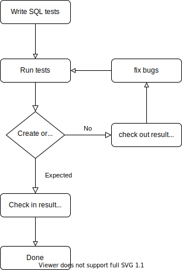

# sqlness

[](https://crates.io/crates/sqlness)
[](https://docs.rs/sqlness)

[](https://github.com/CeresDB/sqlness/actions/workflows/ci.yml)
[](https://github.com/CeresDB/sqlness/issues)

**SQL** integration test har**NESS**

An ergonomic, opinionated framework for SQL integration test.

# Example

See [basic.rs](examples/basic.rs) to learn how to setup a basic test. This is the directory structure of examples

```
$ tree examples/
examples/
├── basic-case               # Testcase root directory
│   └── simple               # One environment
│       ├── config.toml      # Config file for current environment, optional
│       ├── select.result    # Output result file
│       └── select.sql       # Input SQL testcase
├── basic.rs                 # Entrypoint of this example

```

When run it via
```bash
cargo run --example basic
```
It will do following things:
1. Collect all environments(first-level directory) under `basic-case`.
2. Run tests(`.sql` files) under environment one after one.
   1. Before execution it will read `{testcase}.result`(create one if not exists) to memory for compare.
   2. During execution it will collect query response and write to `{testcase}.result`
   3. After execution it will compare the generated `{testcase}.result` with previous one, **PASS** when they are the same, and **FAIL** otherwise.
3. Report result.

Usually `result` files should be tracked in git, whenever there are failed tests, users should
1. Update `result` to latest version(e.g. `git add`) if the newer result is right, or
2. Restore `result` back to original version (e.g. `git checkout`), troubleshoot bugs in database implementation, and run tests again

Flowchart below illustrates the typical steps when write a test.
<p align="center">
  
</p>

Below is the output of this example:
```bash
Run testcase...
Start, env:simple, config:Some("examples/basic-case/simple/config.toml").
Test case "examples/basic-case/simple/select" finished, cost: 0ms
Environment simple run finished, cost:1ms
Stop, env:simple.
MyDB stopped.
```

# Who is using

- [CeresDB](https://github.com/CeresDB/ceresdb), a high-performance, distributed, cloud native time-series database that can handle both time-series and analytics workloads.
- [GreptimeDB](https://github.com/GreptimeTeam/greptimedb/), an open-source, cloud-native, distributed time-series database.

If you’re using sqlness and like to be added to this list, welcome to [open a PR](https://github.com/CeresDB/sqlness/pulls).

# License

This project is under [Apache License 2.0](./LICENSE).
